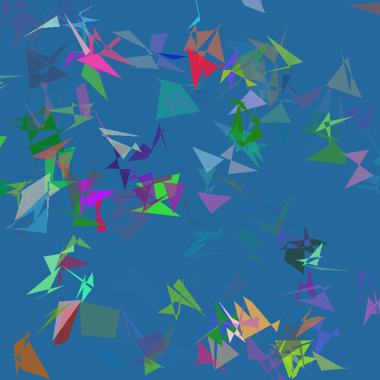
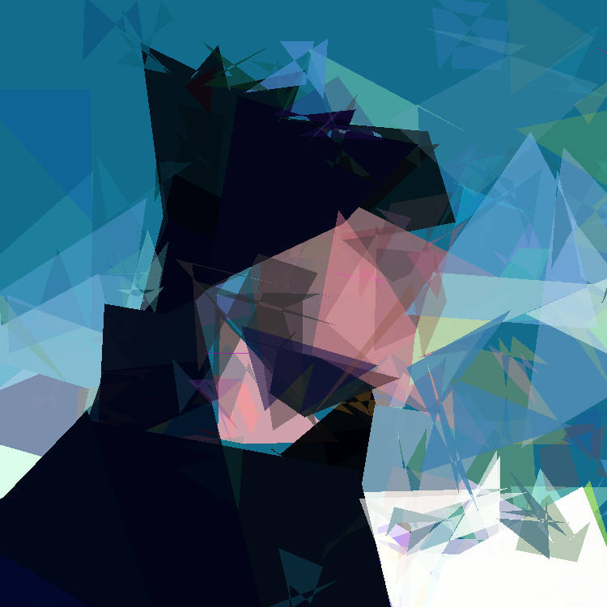
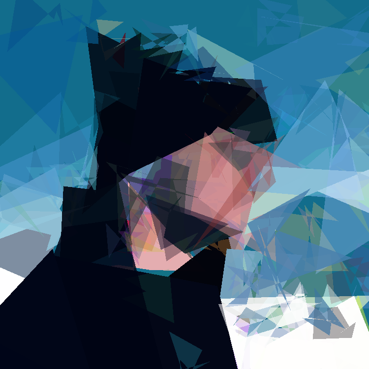

Project Title: Picture Reproduction using Genetic Algorithm
===========================================================

Description
-----------

This project aims to reproduce a given picture using a genetic algorithm. The algorithm will generate a population of polygons and will iteratively improve the population by applying genetic operators such as crossover and mutation. The final goal is to reproduce the target picture with the highest possible similarity.

Usage
-----

1.  Clone the repository

<pre>

<button class="flex ml-auto gap-2"><svg stroke="currentColor" fill="none" stroke-width="2" viewBox="0 0 24 24" stroke-linecap="round" stroke-linejoin="round" class="h-4 w-4" height="1em" width="1em" xmlns="http://www.w3.org/2000/svg"><path d="M16 4h2a2 2 0 0 1 2 2v14a2 2 0 0 1-2 2H6a2 2 0 0 1-2-2V6a2 2 0 0 1 2-2h2"></path><rect x="8" y="2" width="8" height="4" rx="1" ry="1"></rect></svg>Copy code</button>

<code class="!whitespace-pre-wrap hljs language-bash">git clone https://github.com/yourusername/picture-reproduction-genetic-algorithm
</code>

</pre>

2.  Run the main script

<pre>

<button class="flex ml-auto gap-2"><svg stroke="currentColor" fill="none" stroke-width="2" viewBox="0 0 24 24" stroke-linecap="round" stroke-linejoin="round" class="h-4 w-4" height="1em" width="1em" xmlns="http://www.w3.org/2000/svg"><path d="M16 4h2a2 2 0 0 1 2 2v14a2 2 0 0 1-2 2H6a2 2 0 0 1-2-2V6a2 2 0 0 1 2-2h2"></path><rect x="8" y="2" width="8" height="4" rx="1" ry="1"></rect></svg>Copy code</button>

<code class="!whitespace-pre-wrap hljs language-css">python main.py --help
pip install -r requirements.txt
</code>

</pre>

Results
-------

<!-- display assets/img.jpg :-->

    

Note
----

Please note that depending on the complexity of the target picture and the number of polygons, the computation may take a long time. It is recommended to start with a small number of polygons and gradually increase it.